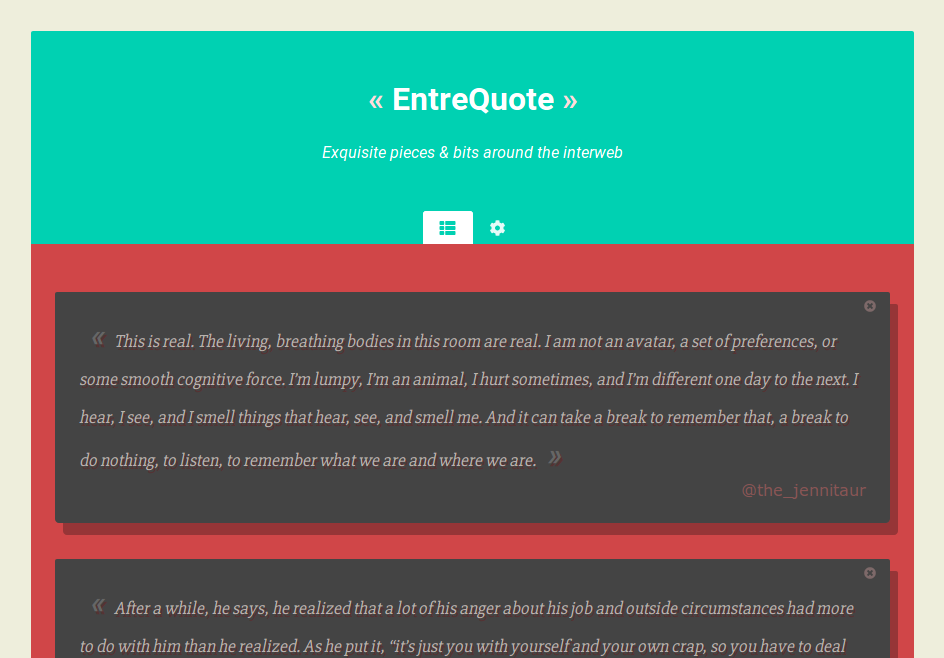

★ ***EntreQuote*** ★ helps you save witty quotes from the Net 🌠 



This repository contains the web application, consisting of : 

 * A RESTful API server built with *Ruby* and *Sinatra*,
 * A front client built with *Vue.js*.

For the web-extension used to communicate with it, please refers to the [entrequote-webextension](https://github.com/tcoppex/entrequote-webextension) repository.

# Quickstart

## Project setup

We will use the `yarn` and `gem` packages manager to install dependencies and compile both frontend and backend code.

```bash
# Install dependencies for the frontend
npm install -g yarn
yarn

# Install Ruby dependencies for the backend.
sudo apt-get install gem
gem install
```

## Run the server

To compile and serve the application, simply type :
```
npm run serve
```

This will start a server set by default to your available local addresses on port *4567*.
You can then visit the application from your [localhost](http://127.0.0.1:4567).

# Project structure overview

* The project root directory contains configurations files :
    - *config.ru* > back-end running script (Rakes),
    - *Gemfile* > back-end ruby packages,
    - *package.json* > front-end packages,
    - *webpack.config.js* > front-end compilation configuration.
* **app/** contains the back-end server code.
* **db/** contains database data.
* **public/** is the server root to be served containing the final compiled files.
* **resources/** contains the front-end code.

# License

*EntreQuote* is released under the *MIT License*.